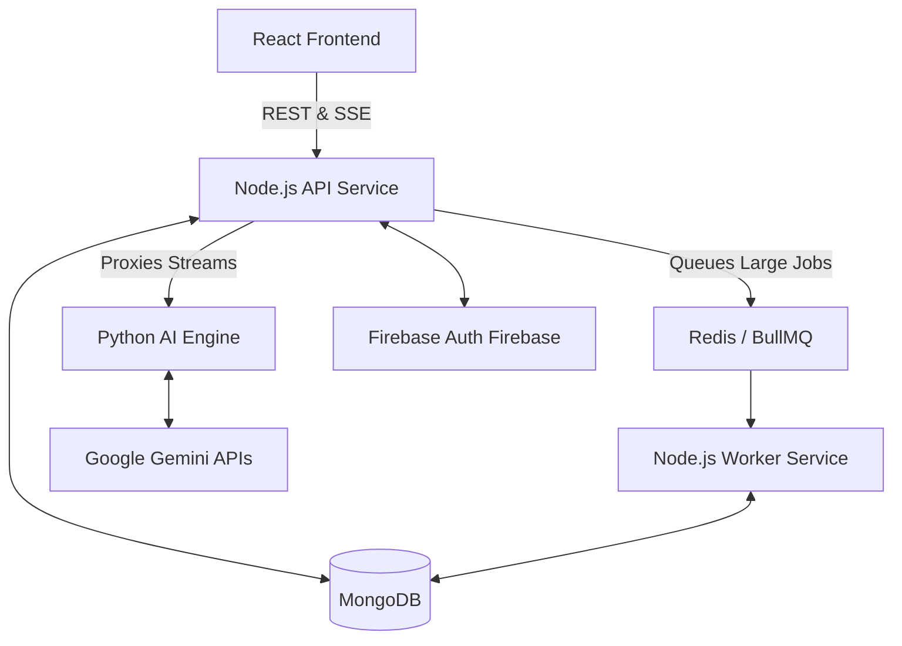

# ChatterBox Application Architecture

ChatterBox is a multi-tier, agent-based AI application designed for concurrent operations, high interactivity, and scalable asynchronous processing. It relies on a modern microservices architecture built on cloud-run services.

## High-Level Architecture

The system is organized into four primary services that interact seamlessly to provide intelligent tools, chat interfaces, and document/data manipulations.

### 1. Frontend Service (React / Vite)
**Location:** `/frontend-service`

The client-facing application is a Single Page Application (SPA) built with React. It provides the user interface for chatting, managing sessions, and interacting with specialized AI "Agents" (like the Excel Agent and Word Agent).
*   **Key Technologies:** React, Context API (for Auth and Credits), Server-Sent Events (SSE) consumer for real-time text streaming.
*   **Concepts:** State management for the chat interface is complex due to live text streaming. The interface automatically parses Markdown to code blocks and tables while data streams in from the API layer.
*   **Agents System:** Modular. Individual plugins like `WordAgent.jsx` or `ExcelAgent.jsx` tap into the shared API tools to display custom interfaces (like spreadsheets or document editors) alongside a chat window.

### 2. API Service (Node.js / Express)
**Location:** `/api-service`

The backend middleware acts as the traffic controller, authentication gatekeeper, and database manager. It handles requests from the Frontend and decides how to process them.
*   **Key Technologies:** Node.js, Express, Mongoose (MongoDB ORM), Firebase Admin (for Auth), BullMQ (for Job Queues).
*   **Concepts:** 
    *   **Proxying:** The API service directly pipes Server-Sent Events (SSE) from the Python AI Engine back to the Frontend so the user sees real-time generation.
    *   **Data Storage:** It stores user chat history, generated images, vector contextual chunks, and application credits in MongoDB.
    *   **Queueing:** For operations that take too long or have payloads that are too large (e.g., massive Excel files), the API service offloads processing to a Redis queue.

### 3. AI Engine Service (Python / FastAPI)
**Location:** `/ai-engine-service`

This is the core "brain" of the agentic functionalities. Due to Python's robust handling of AI SDKs and data tasks, requests involving complex system prompts and AI generation are offloaded here.
*   **Key Technologies:** Python, FastAPI, Google Generative AI Python SDK (`google-generativeai`).
*   **Concepts:** 
    *   **Agent Routing:** Evaluates requests (e.g., "excel" vs "word" agent) and routes them to specialized Python functions.
    *   **Structured Output:** Prompts are meticulously configured to force the AI to return data in specific formats (like strict JSON for spreadsheet updates or document rewrites) wrapped in recognizable markers (`JSON_DATA:`), allowing the API service to parse the exact UI state out of the stream.

### 4. Worker Service (Node.js)
**Location:** `/worker-service`

A background processing service that picks up heavy tasks offloaded by the API service.
*   **Key Technologies:** Node.js, BullMQ.
*   **Concepts:** It listens to the Redis queue for specific jobs (like `processExcel`), interacts with the AI APIs, processes the data, and stores the completed result back into the database or notifies the client on completion. This prevents heavy computational tasks from blocking the main API thread or timing out standard HTTP requests.

---

## Data Flow: Example (Using Word Agent)

1.  **User Action:** User uploads a document, opens the Word Agent, and types "Summarize this into 3 bullet points."
2.  **Frontend State:** `WordAgent.jsx` sets local state to "Thinking" and pushes the raw text to the React context. It makes a `POST /word-agent` request to the API Service.
3.  **API Verification:** `agentController.js` verifying the user token. It packages the document payload and forwards it to the Python AI Engine via `fetch("http://ai-engine:8000/run-agent")`.
4.  **AI Engine Processing:** `word_agent.py` takes the prompt, appends strict structural guidelines, and asks the Gemini model for a stream.
5.  **Streaming Lifecycle:** 
    *   The Python function yields words as they generate.
    *   The Node API pipes these chunks instantly.
    *   The React frontend reads the SSE stream, continuously evaluating and building the visual preview of the text.
6.  **Final Payload:** The Python AI Engine finally generates the `JSON_DATA` block containing the fully parsed new document structure.
7.  **Frontend Resolution:** The frontend intercepts the JSON data and conditionally renders it into the document preview pane.
